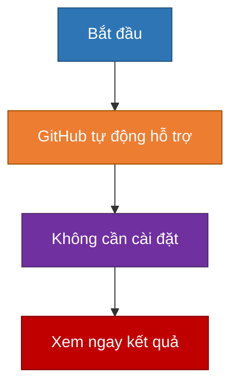

# hoc-mermaid-nk

```mermaid
graph TD
    A[Bắt đầu] --> B[GitHub tự động hỗ trợ]
    B --> C[Không cần cài đặt]
    C --> D[Xem ngay kết quả]

    style A fill:#2E75B6,stroke:#1F4E79,color:#ffffff
    style B fill:#ED7D31,stroke:#9C4D00,color:#ffffff
    style C fill:#7030A0,stroke:#4B2C62,color:#ffffff
    style D fill:#C00000,stroke:#7F0000,color:#ffffff


```
