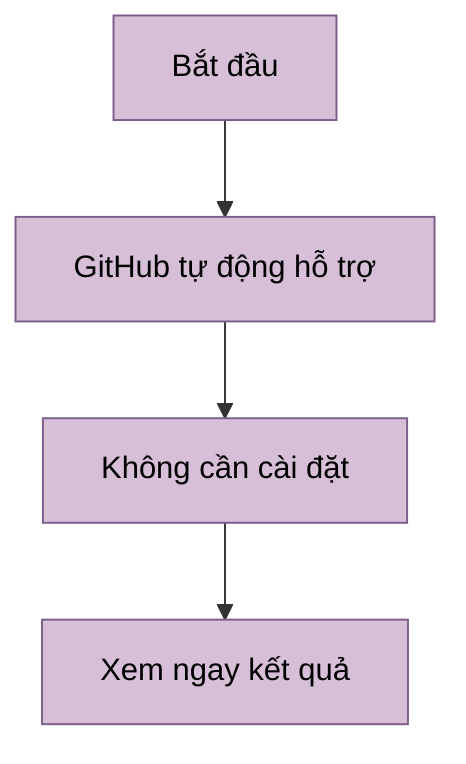

# hoc-mermaid-nk

```mermaid
graph TD
    A[Bắt đầu] --> B[GitHub tự động hỗ trợ]
    B --> C[Không cần cài đặt]
    C --> D[Xem ngay kết quả]

    style A fill:#D8BFD8,stroke:#7A5E8C,color:#000000
    style B fill:#D8BFD8,stroke:#7A5E8C,color:#000000
    style C fill:#D8BFD8,stroke:#7A5E8C,color:#000000
    style D fill:#D8BFD8,stroke:#7A5E8C,color:#000000


```
